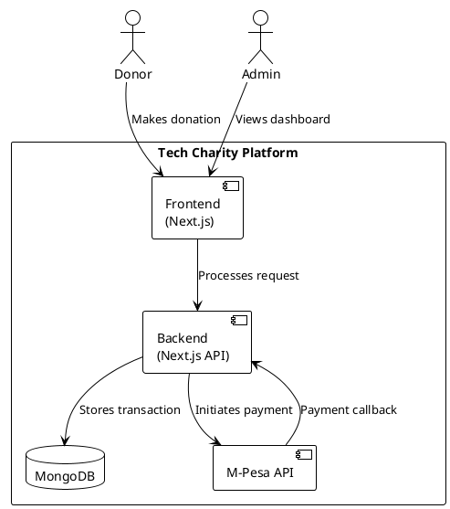
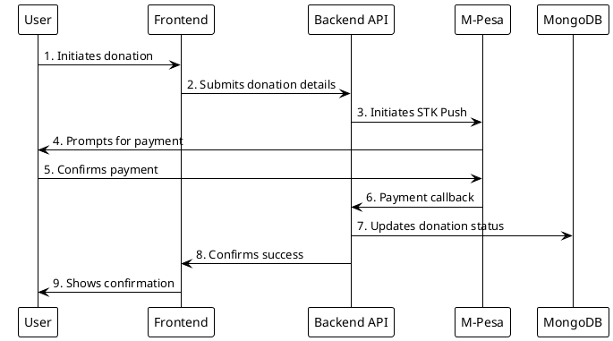
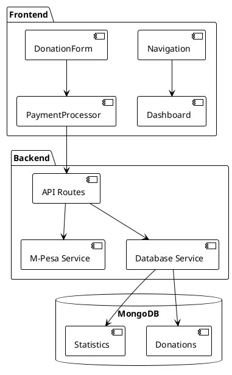
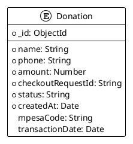
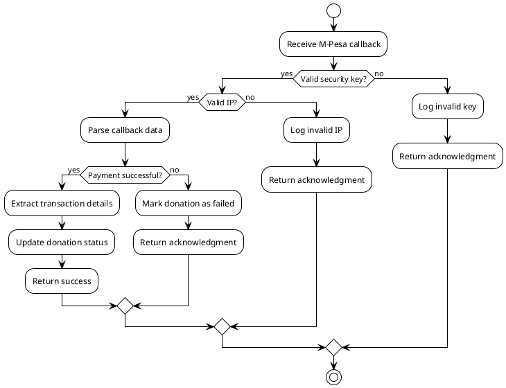

# Tech Charity Platform

A modern web platform built with Next.js that enables charitable donations through M-Pesa integration, featuring a responsive dashboard for tracking donations and impact metrics.

## Table of Contents
- [Overview](#overview)
- [Features](#features)
- [System Architecture](#system-architecture)
- [Getting Started](#getting-started)
- [Environment Setup](#environment-setup)
- [API Documentation](#api-documentation)
- [Database Schema](#database-schema)
- [M-Pesa Integration](#m-pesa-integration)
- [Contributing](#contributing)

## Overview

Tech Charity is a platform designed to bridge the digital divide by facilitating technology education and resources for underserved communities. The platform enables seamless donations through M-Pesa integration and provides real-time tracking of impact metrics.

## Features

- 🌐 Responsive web interface
- 💳 M-Pesa payment integration
- 📊 Real-time donation tracking
- 📱 Mobile-first design
- 🔒 Secure payment processing
- 📈 Impact statistics dashboard

## System Architecture

### Payment Flow

### Component Architecture

## Getting Started

### Prerequisites
- Node.js (v18 or higher)
- MongoDB
- ngrok (for local M-Pesa callback testing)

### Installation

1. Clone the repository:
\`\`\`bash
git clone https://github.com/yourusername/tech-charity.git
cd tech-charity
\`\`\`

2. Install dependencies:
\`\`\`bash
npm install
\`\`\`

3. Set up environment variables:
\`\`\`bash
cp .env.example .env.local
\`\`\`

4. Start the development server:
\`\`\`bash
npm run dev
\`\`\`

## Environment Setup

Create a \`.env.local\` file with the following variables:

\`\`\`env
# Base URL
NEXT_PUBLIC_BASE_URL=http://localhost:3000

# MongoDB
MONGODB_URI=mongodb://localhost:27017/tech_charity

# M-Pesa Configuration
MPESA_CONSUMER_KEY=your_consumer_key
MPESA_CONSUMER_SECRET=your_consumer_secret
MPESA_PASSKEY=your_passkey
MPESA_SHORTCODE=your_shortcode
MPESA_ENVIRONMENT=sandbox

# Development configuration with ngrok
MPESA_CALLBACK_SECRET_KEY=your_secret_key
MPESA_CALLBACK_URL=your_ngrok_url/api/mpesa/your_secret_key
\`\`\`

## API Documentation

### Donation Endpoints

\`\`\`typescript
// Create Donation
POST /api/donations
{
  name: string;
  phone: string;
  amount: number;
}

// Get Donations
GET /api/donations?page=1&limit=10

// Get Donation Stats
GET /api/donations/stats

// M-Pesa Callback
POST /api/mpesa/{secretKey}
\`\`\`

## Database Schema

## M-Pesa Integration

The platform integrates with M-Pesa's STK Push API for payment processing. Here's the flow:

1. User initiates donation
2. System triggers STK push
3. User receives payment prompt
4. User confirms payment
5. M-Pesa sends callback
6. System updates donation status

### Callback Handling

## Contributing

1. Fork the repository
2. Create your feature branch (\`git checkout -b feature/AmazingFeature\`)
3. Commit your changes (\`git commit -m 'Add some AmazingFeature'\`)
4. Push to the branch (\`git push origin feature/AmazingFeature\`)
5. Open a Pull Request

## License

This project is licensed under the MIT License - see the [LICENSE](LICENSE) file for details.

## Acknowledgments

- Next.js team for the amazing framework
- Safaricom for M-Pesa API support
- All contributors who help bridge the digital divide
