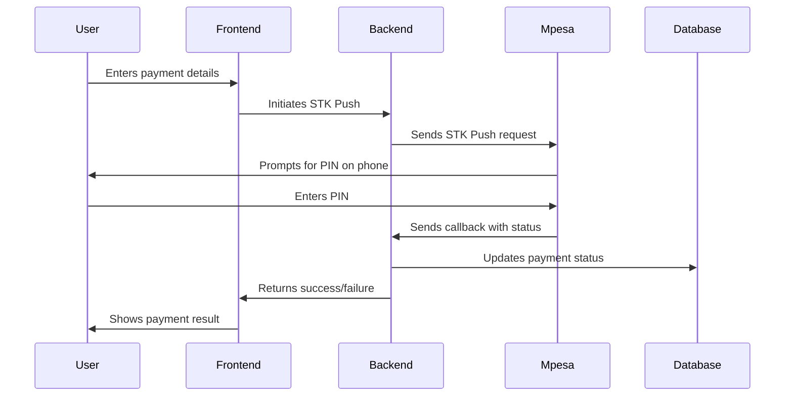
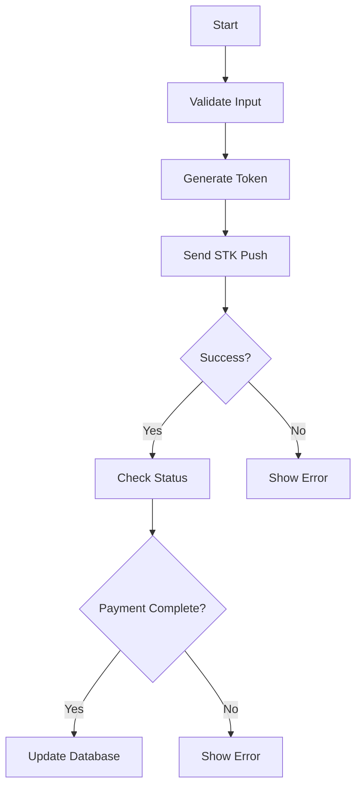
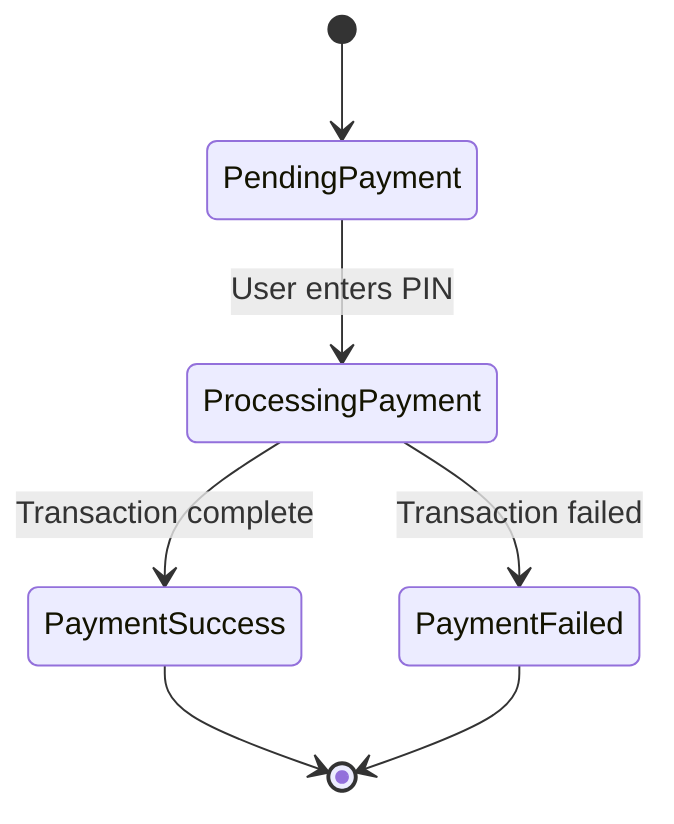
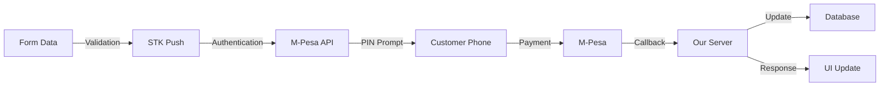

# M-Pesa Integration Tutorial

This tutorial explains how to integrate M-Pesa payments into your Next.js application. We'll cover everything from setup to implementation, using real code examples from this project.

## Table of Contents
- [Prerequisites](#prerequisites)
- [Setup](#setup)
- [How It Works](#how-it-works)
- [Implementation Steps](#implementation-steps)
- [Code Breakdown](#code-breakdown)
- [Testing](#testing)
- [Troubleshooting](#troubleshooting)
- [Understanding M-Pesa Integration](#understanding-m-pesa-integration)

## Prerequisites

1. Safaricom Developer Account
   - Register at [Safaricom Developer Portal](https://developer.safaricom.co.ke/)
   - Create a test app to get your credentials
2. Node.js and Next.js installed
3. Basic understanding of React and API routes

## Setup

1. Create a `.env.local` file with the following variables:
```env
MPESA_CONSUMER_KEY=your_consumer_key
MPESA_CONSUMER_SECRET=your_consumer_secret
MPESA_PASSKEY=your_passkey
MPESA_SHORTCODE=your_shortcode
MPESA_ENVIRONMENT=sandbox
MPESA_CALLBACK_SECRET_KEY=your_secret_key
MPESA_CALLBACK_URL=your_callback_url
```

## How It Works



## Implementation Steps

### 1. Payment Form Component

The payment form collects user details and initiates the payment:

```jsx
// src/components/PaymentForm.jsx
function PaymentForm() {
  const [dataFromForm, setDataFromForm] = useState({
    mpesa_phone: "",
    name: "",
    amount: "",
  });
  
  // ... form JSX and handlers
}
```

### 2. STK Push Implementation

The STK Push process:



Code implementation:

```javascript
// src/actions/stkPush.js
export async function sendStkPush(formData) {
  // Generate auth token
  // Send STK push request
  // Return response
}
```

### 3. Payment Status Check

After initiating payment, we check the status after 3 seconds:

```javascript
const stkPushQueryWithIntervals = async (CheckoutRequestID) => {
  // Wait 3 seconds
  await new Promise(resolve => setTimeout(resolve, 3000));
  
  // Check payment status
  const { data, error } = await stkPushQuery(CheckoutRequestID);
  
  // Update UI based on response
};
```

### 4. Database Updates

When payment is successful, we update the database:

```javascript
// Update payment status
const updateResponse = await fetch('/api/donations/update', {
  method: 'POST',
  headers: {
    'Content-Type': 'application/json',
  },
  body: JSON.stringify({
    checkoutRequestId: CheckoutRequestID,
    mpesaCode: mpesaCode
  })
});
```

## Code Breakdown

### STK Push Query
```javascript
export async function stkPushQuery(CheckoutRequestID) {
  // 1. Generate timestamp
  // 2. Create password
  // 3. Get access token
  // 4. Query transaction status
  // 5. Return formatted response
}
```

### Payment Flow



## Testing

1. Use test credentials from Safaricom Developer Portal
2. Test phone numbers:
   - Format: 254XXXXXXXXX
   - Example: 254712345678
3. Test amounts:
   - Any amount above 1 KES
   - Use small amounts for testing

## Troubleshooting

Common issues and solutions:

1. **STK Push not showing on phone**
   - Verify phone number format
   - Check if using test credentials
   - Ensure proper auth token

2. **Callback not received**
   - Verify callback URL is accessible
   - Check security key configuration
   - Verify IP whitelist in production

3. **Status not updating**
   - Check network connectivity
   - Verify transaction ID
   - Check database connection

## Best Practices

1. Always validate phone numbers
2. Use proper error handling
3. Implement timeout handling
4. Secure your credentials
5. Log important events
6. Handle edge cases
7. Implement proper error messages

## Security Considerations

1. Never expose credentials in frontend code
2. Validate all inputs
3. Use HTTPS
4. Implement rate limiting
5. Validate callback source
6. Secure sensitive routes

## Production Deployment

When deploying to production:

1. Update environment variables
2. Use production M-Pesa credentials
3. Enable proper error logging
4. Set up monitoring
5. Configure proper callback URLs
6. Enable IP whitelisting

## Support

For issues and questions:
1. Check Safaricom Developer documentation
2. Review M-Pesa API specifications
3. Check server logs for errors
4. Verify transaction status in Safaricom portal

## Understanding M-Pesa Integration

### Simple Explanation (Non-Technical)

Think of M-Pesa integration like a digital cashier that helps process payments between your customer and your business. Here's how it works in simple terms:

1. **Customer Experience**
   - Customer fills out a form with their name, phone number, and amount
   - They get an M-Pesa prompt on their phone (like usual M-Pesa payments)
   - They enter their PIN
   - They receive an M-Pesa message confirming payment

2. **Behind the Scenes**
   - The website sends a request to M-Pesa to start the payment
   - M-Pesa sends the PIN prompt to the customer's phone
   - When customer enters PIN, M-Pesa processes the payment
   - M-Pesa tells the website if payment was successful
   - The website updates to show success or failure

3. **Key Components**
   - Payment Form: Where customers enter their details
   - STK Push: The M-Pesa prompt on phone
   - Callback: M-Pesa's way of confirming payment
   - Database: Stores payment information

### Technical Deep-Dive

#### 1. Payment Form (`PaymentForm.jsx`)
```javascript
// This component handles user input and payment initiation
function PaymentForm() {
  // State management for form data
  const [dataFromForm, setDataFromForm] = useState({
    mpesa_phone: "",
    name: "",
    amount: "",
  });

  // Form submission handler
  const handleSubmit = async (e) => {
    e.preventDefault();
    // Validates phone number format (must be Kenyan)
    // Initiates STK push
    // Handles loading states and errors
  };
}
```

**What it does:**
- Manages form state using React hooks
- Validates input (phone format, minimum amount)
- Triggers payment process
- Handles UI feedback (loading, success, error states)

#### 2. STK Push Process (`stkPush.js`)
```javascript
export async function sendStkPush(formData) {
  // 1. Format phone number (254XXXXXXXXX)
  const formattedPhone = phoneNumber.replace(/^0/, "254");
  
  // 2. Generate security credentials
  const timestamp = new Date().toISOString();
  const password = base64Encode(shortcode + passkey + timestamp);
  
  // 3. Get M-Pesa access token
  const accessToken = await getMpesaToken();
  
  // 4. Send STK Push request
  const stkResponse = await axios.post(
    "https://sandbox.safaricom.co.ke/mpesa/stkpush/v1/processrequest",
    {
      BusinessShortCode: process.env.MPESA_SHORTCODE,
      Password: password,
      Timestamp: timestamp,
      TransactionType: "CustomerPayBillOnline",
      Amount: amount,
      PartyA: formattedPhone,
      PartyB: process.env.MPESA_SHORTCODE,
      PhoneNumber: formattedPhone,
      CallBackURL: process.env.MPESA_CALLBACK_URL,
      AccountReference: phoneNumber,
      TransactionDesc: "Donation Payment"
    }
  );
}
```

**What it does:**
- Formats data according to M-Pesa API requirements
- Generates security credentials
- Obtains authentication token
- Sends payment request to M-Pesa
- Returns checkout ID for tracking

#### 3. Payment Status Check (`stkPushQuery.js`)
```javascript
export async function stkPushQuery(CheckoutRequestID) {
  // Similar security setup as STK Push
  const timestamp = generateTimestamp();
  const password = generatePassword();
  const token = await getAccessToken();

  // Query M-Pesa for transaction status
  const response = await queryMpesa({
    CheckoutRequestID,
    timestamp,
    password
  });

  // Format and return response
  return {
    data: {
      ResultCode: response.ResultCode,
      ResultDesc: response.ResultDesc
    }
  };
}
```

**What it does:**
- Checks payment status after 3 seconds
- Uses checkout ID to query specific transaction
- Returns formatted status response

#### 4. Database Updates (`donationService.js`)
```javascript
export async function updateDonationByCheckoutId(checkoutRequestId, updateData) {
  // Connect to MongoDB
  const client = await clientPromise;
  const db = client.db();

  // Update donation record
  return db.collection('donations').updateOne(
    { checkoutRequestId },
    { $set: updateData }
  );
}
```

**What it does:**
- Updates payment status in database
- Stores M-Pesa transaction details
- Maintains payment history

#### 5. Security Implementation

```javascript
// IP Whitelist for M-Pesa callbacks
const SAFARICOM_IPS = [
  '196.201.214.200',
  '196.201.214.206',
  // ... other IPs
];

// Callback security
export async function POST(request, { params }) {
  // 1. Validate security key
  if (params.securityKey !== process.env.MPESA_CALLBACK_SECRET_KEY) {
    return NextResponse.json("ok", { status: 200 });
  }

  // 2. Validate IP in production
  if (process.env.NODE_ENV === 'production') {
    const clientIp = request.headers.get('x-forwarded-for');
    if (!SAFARICOM_IPS.includes(clientIp)) {
      return NextResponse.json("ok", { status: 200 });
    }
  }

  // Process callback data
}
```

**What it does:**
- Validates callback authenticity
- Protects against unauthorized access
- Ensures callbacks are from M-Pesa

### Data Flow Explanation



This diagram shows how data flows through the system:
1. Form data is validated
2. STK Push request is authenticated and sent
3. Customer receives prompt and pays
4. M-Pesa processes and confirms
5. Our system updates records
6. User sees confirmation 